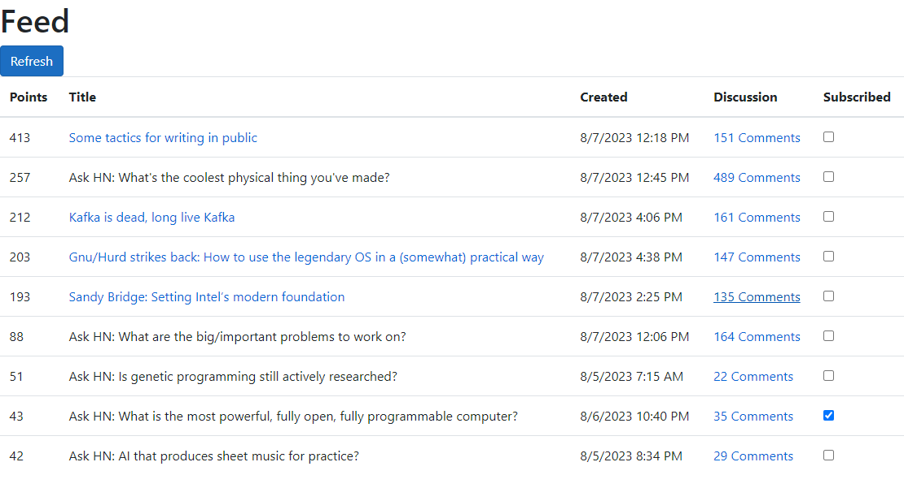
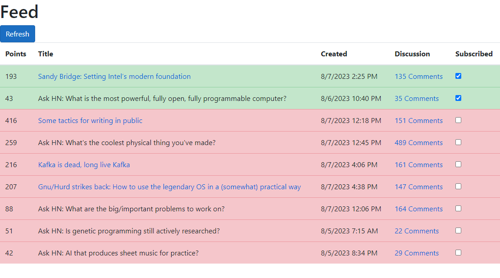
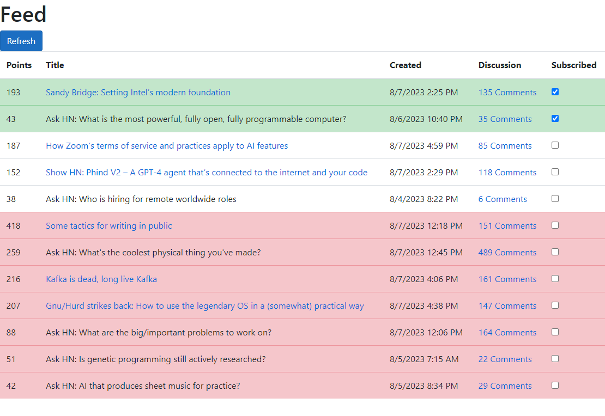

# Hacker News Feed

An alternative Hacker News frontend. Allows you to keep track of any interesting submissions and ignore everything else. This project was made to practice some of the concepts discussed in Andrew Lock's [_ASP.NET Core in Action, Second Edition_](https://www.manning.com/books/asp-net-core-in-action-second-edition). For a discussion on the development of this project, see its associated [blog post](https://ejacobg.com/projects/hacker-news-feed/).

The feed displays the current Hacker News front page and the entire Ask HN section on the same screen. You can then use the feed like how you would normally use the website - open any interesting articles and take a look at the discussion around them.

The feed allows you to mark submissions as "subscribed" (highlighted in green) or "unsubscribed" (highlighted in red). This is to help keep track of which ones are actually of interest to you. When you refresh* the feed, your subscribed submissions will be moved toward the top, with the unsubscribed ones moved toward the bottom. Subscribing to a submission can be done using the checkbox input or by visiting its discussion thread.

The feed can be refreshed in two ways: (1) using the browser controls (Ctrl+R, F6, refresh button, etc.), and (2) using the `Refresh` button on the feed page. Both methods will pull and display any updated front page and Ask HN data. The difference between them is in how they handle subscriptions. The browser controls will leave any "undecided" submissions (no highlight is applied) as undecided. When using the `Refresh` button, any undecided submissions will be marked as unsubscribed.

## Examples

When you run the application for the first time, all of the submissions will be undecided (no highlight is applied). Click on a submission's discussion link or mark the checkbox to subscribe to it:

Once you've subscribed to everything that interests you, use the `Refresh` button to unsubscribe from everything else:

To check in on any developing discussions or to see if anything new was added to the homepage, refresh the page again (using either the browser controls or the `Refresh` button):

You can always resubscribe to any articles. Changes are applied on the next refresh.

## Future Work

I've gotten mostly everything that I want out of this project and will be putting development on hold for now. In case I wish to revisit this, here are some nice-to-haves to implement:

- Automatically dump the database after N days.
- Deploy the application, allow users to have their own sessions.
- Calculate points/comments change between refreshes.
- Update the front page query (currently only considers points; does not consider the age of the submission).
- Using better methods for concurrency control.
